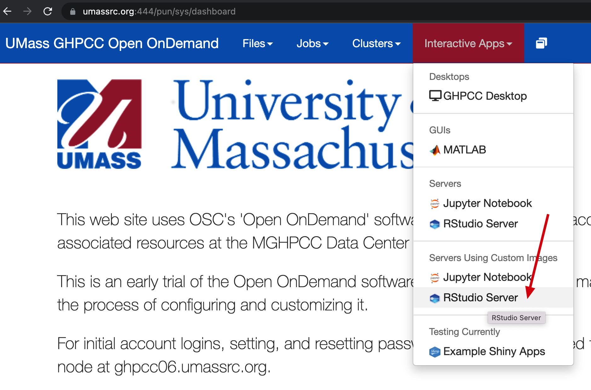
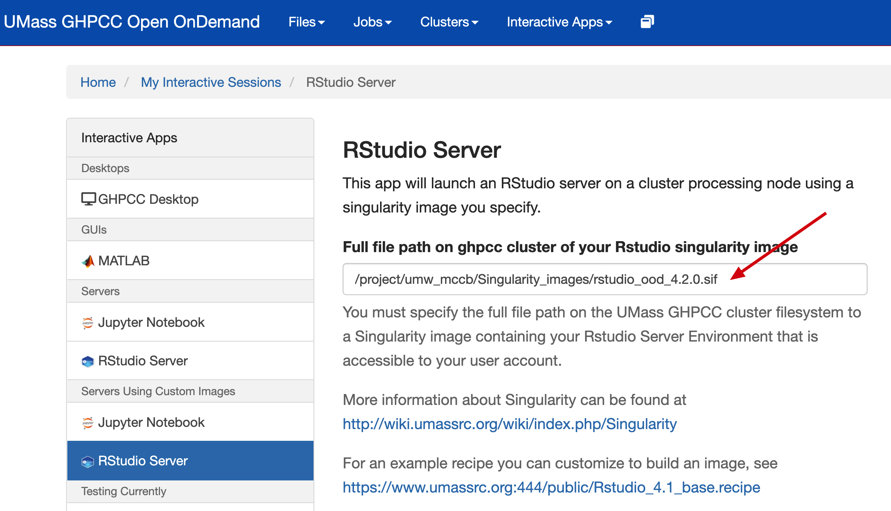
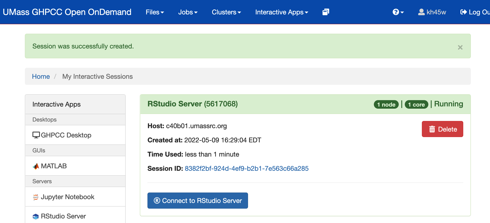

# Rstudio with R 4.2.0

## How to use it with UMass OOD
**UMass OOD relies on internal network, therefore need to connect to VPN first if not on campus.**
1. Login to [UMass OOD](https://www.umassrc.org:444/) with your HPCC credentials.
2. Select **Interactive Apps** -> **RStudio Server** as well as desired resources: 
3. Select the pre-built image that is located at `/project/umw_mccb/Singularity_images/rstudio_ood_4.2.0.sif`: 
4. Click Launch, note that it may take up to a few minutes to initiate (**Don't double click! Otherwise, multiple sessions will be created!**).
5. Click `Connect to RStudio Server` to continue:


## Side notes
1.  Installing custom R packages:

They will be installed to:
```
> .libPaths()
[1] "/home/your_hpcc_username/R/x86_64-pc-linux-gnu-library/4.2"
[2] "/opt/R/4.2.0/lib/R/library"
```
Note that the Singularity image itself is not writable, but the installed R packages will remain there for your future use so that you don't need to re-install them.

2.  To use a separate library folder:

You can set `.libPath()`. Check out this accepted [answer](https://stackoverflow.com/questions/15170399/change-r-default-library-path-using-libpaths-in-rprofile-site-fails-to-work) from GitHub.

3.  Missing libraries?

You can create a custom image by adding desired tools into the Singularity recipe and rebuild. Checkout [README](../README.md) and [template recipe](rstudio_ood_4.2.0.recipe).

## References
1. Template rstudio_ood_4.2.0.recipe authored by: hpcc-support@umassmed.edu
